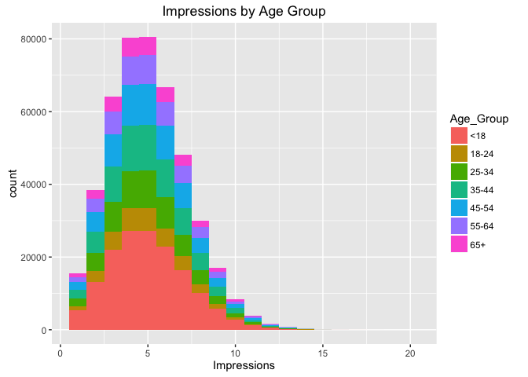
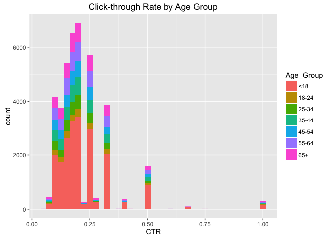
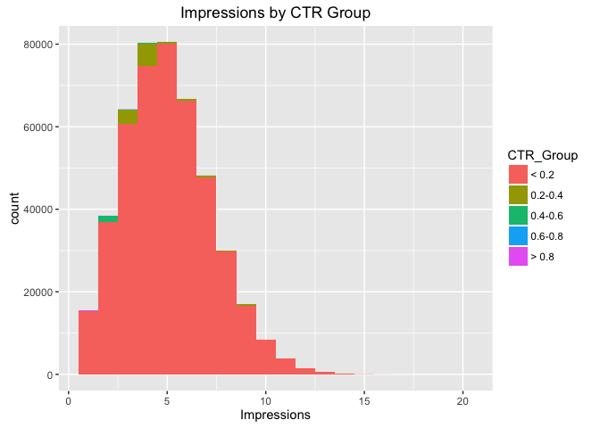
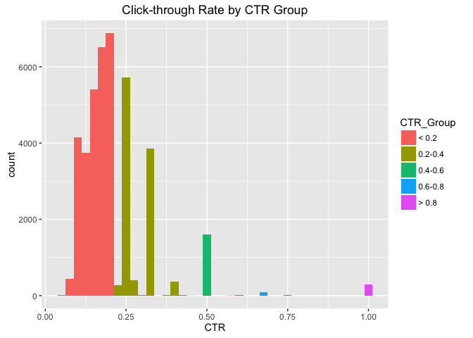
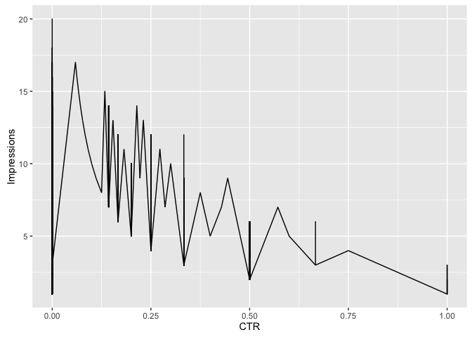

# Week 8 Live Session--Module 8.9
Tony Garza  
June 29, 2016  
# Prep Data

```r
fileLocation <- "http://stat.columbia.edu/~rachel/datasets/nyt1.csv"
data1 <- read.csv(url(fileLocation))
head(data1)
```

```
##   Age Gender Impressions Clicks Signed_In
## 1  36      0           3      0         1
## 2  73      1           3      0         1
## 3  30      0           3      0         1
## 4  49      1           3      0         1
## 5  47      1          11      0         1
## 6  47      0          11      1         1
```

```r
data1$Age_Group <- cut(data1$Age, c(-Inf, 18, 24, 34, 44, 54, 64, Inf))
levels(data1$Age_Group) <- c("<18", "18-24", "25-34", "35-44", "45-54", "55-64", "65+")
head(data1)
```

```
##   Age Gender Impressions Clicks Signed_In Age_Group
## 1  36      0           3      0         1     35-44
## 2  73      1           3      0         1       65+
## 3  30      0           3      0         1     25-34
## 4  49      1           3      0         1     45-54
## 5  47      1          11      0         1     45-54
## 6  47      0          11      1         1     45-54
```

```r
ImpSub <- subset(data1, Impressions>0)
ImpSub$CTR <- ImpSub$Clicks/ImpSub$Impressions
head(data1)
```

```
##   Age Gender Impressions Clicks Signed_In Age_Group
## 1  36      0           3      0         1     35-44
## 2  73      1           3      0         1       65+
## 3  30      0           3      0         1     25-34
## 4  49      1           3      0         1     45-54
## 5  47      1          11      0         1     45-54
## 6  47      0          11      1         1     45-54
```

```r
head(ImpSub)
```

```
##   Age Gender Impressions Clicks Signed_In Age_Group        CTR
## 1  36      0           3      0         1     35-44 0.00000000
## 2  73      1           3      0         1       65+ 0.00000000
## 3  30      0           3      0         1     25-34 0.00000000
## 4  49      1           3      0         1     45-54 0.00000000
## 5  47      1          11      0         1     45-54 0.00000000
## 6  47      0          11      1         1     45-54 0.09090909
```

# Analysis of Click Stream Data (PART1)

```r
library(ggplot2)
ggplot(subset(ImpSub, Impressions>0), aes(x=Impressions, fill=Age_Group)) + geom_histogram(binwidth=1)+labs(title="Impressions by Age Group") # plot of Impressions by Age Group
```

<!-- -->

```r
ggplot(subset(ImpSub, CTR>0), aes(x=CTR, fill=Age_Group))+labs(title="Click-through Rate by Age Group") +geom_histogram(binwidth=.025) # Plot of CTR by Age Group
```

<!-- -->

```r
ImpSub$CTR_Group <- cut(ImpSub$CTR, c(-Inf, 0.2, 0.4, 0.6, 0.8, Inf))
levels(ImpSub$CTR_Group) <- c("< 0.2", "0.2-0.4", "0.4-0.6", "0.6-0.8", "> 0.8")
head(ImpSub)
```

```
##   Age Gender Impressions Clicks Signed_In Age_Group        CTR CTR_Group
## 1  36      0           3      0         1     35-44 0.00000000     < 0.2
## 2  73      1           3      0         1       65+ 0.00000000     < 0.2
## 3  30      0           3      0         1     25-34 0.00000000     < 0.2
## 4  49      1           3      0         1     45-54 0.00000000     < 0.2
## 5  47      1          11      0         1     45-54 0.00000000     < 0.2
## 6  47      0          11      1         1     45-54 0.09090909     < 0.2
```

```r
str(ImpSub)
```

```
## 'data.frame':	455375 obs. of  8 variables:
##  $ Age        : int  36 73 30 49 47 47 0 46 16 52 ...
##  $ Gender     : int  0 1 0 1 1 0 0 0 0 0 ...
##  $ Impressions: int  3 3 3 3 11 11 7 5 3 4 ...
##  $ Clicks     : int  0 0 0 0 0 1 1 0 0 0 ...
##  $ Signed_In  : int  1 1 1 1 1 1 0 1 1 1 ...
##  $ Age_Group  : Factor w/ 7 levels "<18","18-24",..: 4 7 3 5 5 5 1 5 1 5 ...
##  $ CTR        : num  0 0 0 0 0 ...
##  $ CTR_Group  : Factor w/ 5 levels "< 0.2","0.2-0.4",..: 1 1 1 1 1 1 1 1 1 1 ...
```

```r
sum(is.na(ImpSub)) #double-checking that there are no NAs
```

```
## [1] 0
```

```r
sum(ImpSub$Gender) #Calculate Sums
```

```
## [1] 167146
```

```r
sum(ImpSub$Age) #Calculate Sums
```

```
## [1] 13426281
```

```r
sum(ImpSub$Impressions) #Calculate Sums
```

```
## [1] 2295559
```

```r
sum(ImpSub$Signed_In) #Calculate Sums
```

```
## [1] 319198
```

```r
summary(ImpSub) #This gives us means of the requested items
```

```
##       Age             Gender        Impressions         Clicks       
##  Min.   :  0.00   Min.   :0.0000   Min.   : 1.000   Min.   :0.00000  
##  1st Qu.:  0.00   1st Qu.:0.0000   1st Qu.: 3.000   1st Qu.:0.00000  
##  Median : 31.00   Median :0.0000   Median : 5.000   Median :0.00000  
##  Mean   : 29.48   Mean   :0.3671   Mean   : 5.041   Mean   :0.09322  
##  3rd Qu.: 48.00   3rd Qu.:1.0000   3rd Qu.: 6.000   3rd Qu.:0.00000  
##  Max.   :108.00   Max.   :1.0000   Max.   :20.000   Max.   :4.00000  
##                                                                      
##    Signed_In     Age_Group           CTR            CTR_Group     
##  Min.   :0.000   <18  :155303   Min.   :0.00000   < 0.2  :442700  
##  1st Qu.:0.000   18-24: 35014   1st Qu.:0.00000   0.2-0.4: 10623  
##  Median :1.000   25-34: 57801   Median :0.00000   0.4-0.6:  1647  
##  Mean   :0.701   35-44: 70394   Mean   :0.01847   0.6-0.8:   106  
##  3rd Qu.:1.000   45-54: 63845   3rd Qu.:0.00000   > 0.8  :   299  
##  Max.   :1.000   55-64: 44462   Max.   :1.00000                   
##                  65+  : 28556
```

```r
sapply(ImpSub,mean) #This is another way to get means, returns "NA" on values that are not numeric
```

```
## Warning in mean.default(X[[i]], ...): argument is not numeric or logical:
## returning NA

## Warning in mean.default(X[[i]], ...): argument is not numeric or logical:
## returning NA
```

```
##         Age      Gender Impressions      Clicks   Signed_In   Age_Group 
## 29.48400988  0.36705133  5.04102992  0.09321768  0.70095635          NA 
##         CTR   CTR_Group 
##  0.01847053          NA
```

```r
library(plyr)
ddply(ImpSub, .(Age_Group), summarize, Impressions=mean(Impressions), CTR=mean(CTR), PercentMales=mean(Gender), Signed_In=mean(Signed_In))
```

```
##   Age_Group Impressions         CTR PercentMales Signed_In
## 1       <18    5.033534 0.028141310    0.0790648 0.1231528
## 2     18-24    5.043240 0.009720481    0.5339864 1.0000000
## 3     25-34    5.026055 0.010146329    0.5319977 1.0000000
## 4     35-44    5.054749 0.010286330    0.5317072 1.0000000
## 5     45-54    5.045172 0.009957612    0.5292192 1.0000000
## 6     55-64    5.053484 0.020306816    0.5359633 1.0000000
## 7       65+    5.046925 0.029802702    0.3632512 1.0000000
```
# Analysis of Click Stream Data (PART2)

```r
### Table of CTR_Group v Age_Group
x1 <- ddply(ImpSub, .(Age_Group), summarize, Impressions=sum(Impressions), CTR=sum(CTR), TotalMales=sum(Gender), Signed_In=sum(Signed_In)) #get the sums by Age_Group
y1 <- ddply(ImpSub, .(CTR_Group), summarize, Impressions=sum(Impressions), CTR=sum(CTR), TotalMales=sum(Gender), Signed_In=sum(Signed_In)) #get the sums by CTR_Group
colnames(x1)[1]<-"AGEorCTR_GROUPS" #rename first column for join prep
colnames(y1)[1]<-"AGEorCTR_GROUPS" #rename first column for join prep

library(dplyr) #load dplyr for join function
```

```
## 
## Attaching package: 'dplyr'
```

```
## The following objects are masked from 'package:plyr':
## 
##     arrange, count, desc, failwith, id, mutate, rename, summarise,
##     summarize
```

```
## The following objects are masked from 'package:stats':
## 
##     filter, lag
```

```
## The following objects are masked from 'package:base':
## 
##     intersect, setdiff, setequal, union
```

```r
JoinTable<-full_join(x1, y1) #join x1 and y1
```

```
## Joining by: c("AGEorCTR_GROUPS", "Impressions", "CTR", "TotalMales", "Signed_In")
```

```
## Warning in outer_join_impl(x, y, by$x, by$y): joining factors with
## different levels, coercing to character vector
```

```r
str(JoinTable)
```

```
## 'data.frame':	12 obs. of  5 variables:
##  $ AGEorCTR_GROUPS: chr  "<18" "18-24" "25-34" "35-44" ...
##  $ Impressions    : int  781723 176584 290511 355824 322109 224688 144120 2246564 44428 3915 ...
##  $ CTR            : num  4370 340 586 724 636 ...
##  $ TotalMales     : int  12279 18697 30750 37429 33788 23830 10373 163827 2786 427 ...
##  $ Signed_In      : int  19126 35014 57801 70394 63845 44462 28556 312627 5528 850 ...
```

```r
JoinTable #Table of CTR_Group v Age_Group
```

```
##    AGEorCTR_GROUPS Impressions       CTR TotalMales Signed_In
## 1              <18      781723 4370.4299      12279     19126
## 2            18-24      176584  340.3529      18697     35014
## 3            25-34      290511  586.4679      30750     57801
## 4            35-44      355824  724.0959      37429     70394
## 5            45-54      322109  635.7437      33788     63845
## 6            55-64      224688  902.8816      23830     44462
## 7              65+      144120  851.0460      10373     28556
## 8            < 0.2     2246564 4176.9575     163827    312627
## 9          0.2-0.4       44428 3040.5287       2786      5528
## 10         0.4-0.6        3915  823.0317        427       850
## 11         0.6-0.8         331   71.5000         21        36
## 12           > 0.8         321  299.0000         85       157
```

```r
### Plot of Impressions by CTR Group
ggplot(subset(ImpSub, Impressions>0), aes(x=Impressions, fill=CTR_Group)) + geom_histogram(binwidth=1)+labs(title="Impressions by CTR Group")
```

<!-- -->

```r
### Plot of CTR by CTR Group
ggplot(subset(ImpSub, CTR>0), aes(x=CTR, fill=CTR_Group))+labs(title="Click-through Rate by CTR Group") +geom_histogram(binwidth=.025)
```

<!-- -->

```r
### Plot of CTR vs Impressions
ggplot(ImpSub, aes(CTR,Impressions)) +geom_line()
```

<!-- -->
<br\>

Mathmatically, it stands to reason that we should see CTR decrease as Impressions increase.
